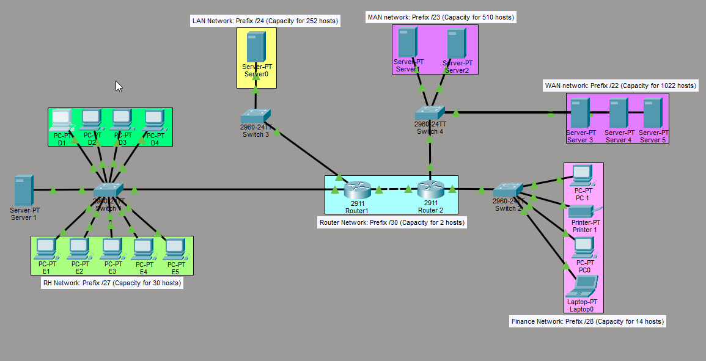
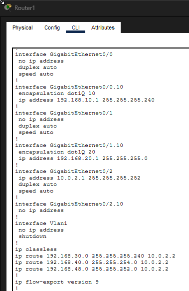

# Subnetting-Project-in-Packet-Tracer
This simulated Subnetting lab was conducted in Cisco Packet Tracer, where I will show you which prefixes are most commonly used in each network. The main objective of this project is to show how to calculate the subnet manually and what it is used for.


First, I will show the visual part of the network topology built in the simulator.


But why use subnetting and custom prefixes? The main reasons are:

- Network organization
- Minimizing IP waste on the network
- Reducing broadcast traffic (latency)


These are the main reasons for using subnetting, but which prefixes should be used and how can they be identified?

- The larger the network, the shorter the prefix. Here are the main prefixes:

Subnetting Table

```
Prefix (CIDR), |   Decimal Mask     |  Jump (Third Octet) | Jump (Fourth Octet) |  Capacity (Useful IPs)  |
    /22        |   255.255.252.0    |         4           |                     |          1022           |
    /23        |   255.255.254.0    |         2           |                     |          510            |
    /24        |   255.255.255.0    |         1           |                     |          254            |
    /27        |   255.255.255.224  |                     |          32         |          30             |
    /28        |   255.255.255.240  |                     |          16         |          14             |
    /29        |   255.255.255.248  |                     |          8          |          6              |
    /30        |   255.255.255.252  |                     |          4          |          2              |
```

Switch configuration:


In this section, switch 1 was configured as a demonstration. The following was configured:

-VLAN
-Access port and trunk

I followed the same pattern for the other switches, configuring and creating the VLANs and access and trunk ports.


Pattern used:
````
VLAN 10 
name HR

VLAN 20
name finance

Port pattern:
interface fa0/1
switchport mode access
switchport access VLAN 10

interface fa0/2
switchport mode access
switchport access VLAN 20
````

I applied the above pattern to all four switches on the network, configuring from VLAN 10 to VLAN 48.

List of VLANs:
VLAN 10: HR
VLAN 20: FINANCE
VLAN 30: LAN
VLAN 40: MAN
VLAN 48: WAN

VLAN:  Logical segmented department, used to divide networks in an organized manner, maximizing security and organization.


Router Configuration:



In this section, the routers have been configured. The network has Router 1 and Router 2.

Router 1: connected to switches 1 and 3, used for trunking on VLANs 10 and 30.

Router 2: connected to switches 2 and 4, used for trunking on VLANs 20, 40, and 48.

Standard used:
````
encapsulation dot1Q 10
ip addr 192.168.10.1 255.255.255.224

encapsulation dot1Q 20
ip addr 192.168.20.1 255.255.255.240

ip route 192.168.30.0 255.255.255.240 10.0.2.2
ip route 192.168.40.0 255.255.254.0 10.0.2.2
````

On Router 2, the same configuration pattern was used, but changing the number of:

- IP address of each encapsulation
- Encapsulation number
- IP route number
- Subnet mask number

Why encapsulation?
A: So that each packet/frame and data transported on the network has a correct identification and process to reach the correct destination safely and completely.

Why IP routing?
A: So that a department on Router 1 can communicate with another department on Router 2, for example, to be able to communicate outside the network as well.
